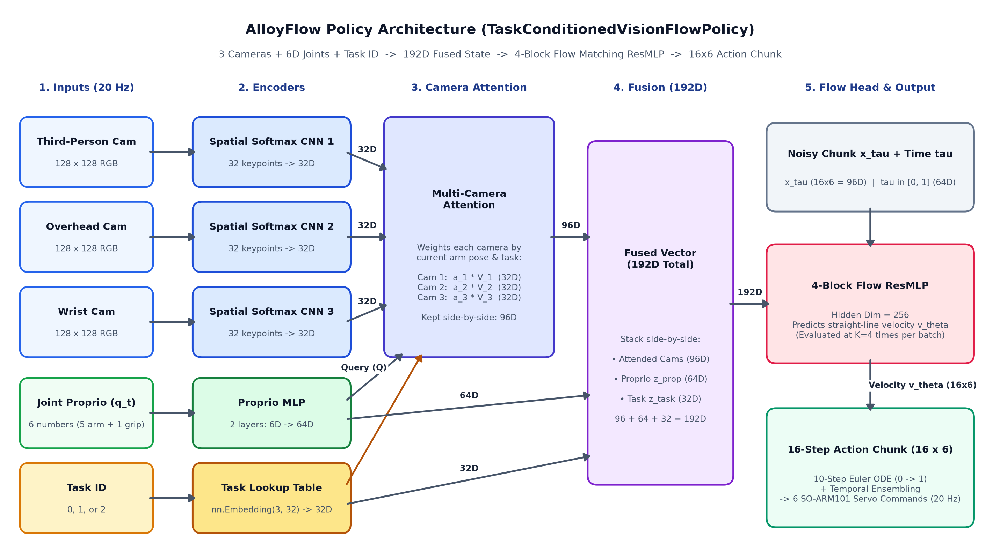

# AlloyFlow: System Design

**AlloyFlow** is a multi-task robot learning project for the **SO-ARM101** robot arm (`5` arm joints + `1` gripper = `6` joints total). It trains a single neural network policy to perform 3 tabletop tasks and compares how well the robot learns from simulation data, real-world data, finetuning, and co-training.

***

## 1. Core Objectives

### Objective 1: Train One Model to Perform 3 Tasks
Train **one single model** that takes 3 camera images (`128x128`), the robot's `6` current joint positions, and a task ID (`0`, `1`, or `2`), and outputs the robot's next `16` steps of joint movements.

All 3 tasks use the same tabletop setup with **4 everyday objects**:
1. **Pen Holder**: A small desktop pen holder without a pen (`4 to 5 cm` wide).
2. **Small Cup**: A lightweight plastic, paper, or espresso cup.
3. **Bowl**: A target container (`~10 cm` wide).
4. **Rubik's Cube**: A standard `5.6 cm` cube used as a flat base for stacking.

By changing only the task ID (`0`, `1`, or `2`), the same model performs 3 different tasks:
1. **Task 0 (`pick_pen_holder_to_bowl`)**: Pick up the pen holder and place it inside the bowl.
2. **Task 1 (`pick_cup_to_bowl`)**: Ignore the pen holder, pick up the small cup, and place it inside the bowl. (Tests picking a different object for the same destination).
3. **Task 2 (`stack_cup_on_cube`)**: Pick up the small cup and stack it on top of the Rubik's cube. (Tests picking the same object as Task 1, but placing it on a different target).

### Objective 2: Compare 4 Training Modes
Using the exact same model architecture and test episodes, compare how the robot performs across **4 training modes**:
1. **Mode 1: `Sim-Only` (`100%` Simulation Data)**
   - **Training**: Trained only on MuJoCo simulation demos (`100` demos per task, `300` total).
   - **Goal**: Measure baseline performance in simulation, and test how well a simulation-only model transfers directly to the real robot without any real training data.
2. **Mode 2: `Real-Only` (`100%` Real Robot Data)**
   - **Training**: Trained only on a small set of real robot demos (`20` demos per task, `60` total).
   - **Goal**: Measure how well the real robot learns from limited real data, and where it fails when objects are placed in new positions.
3. **Mode 3: `Sim -> Real Finetune` (Pretrain in Sim, then Finetune on Real)**
   - **Training**: Start from the `Mode 1 (Sim-Only)` model weights, then continue training on the `20` real demos per task (`60` total).
   - **Goal**: Measure if pretraining in simulation helps real-world performance, and check if finetuning causes the model to forget how to solve the simulation tasks.
4. **Mode 4: `Sim + Real Co-Training` (`50%` Sim + `50%` Real in Every Batch)**
   - **Training**: Train from scratch where every batch of `128` samples pulls `64` samples from the `300` simulation demos and `64` samples from the `60` real robot demos.
   - **Goal**: Test if mixing simulation and real data in every batch gives the best real-world generalization while keeping high performance in simulation.

***

## 2. Robot Hardware & Simulation Setup (`SO-ARM101`)

* **Robot Arm**: 6-DoF **SO-ARM101** (`5` Feetech STS3215 arm servos: `shoulder_pan`, `shoulder_lift`, `elbow_flex`, `wrist_flex`, `wrist_roll` + `1` gripper servo).
* **Inputs & Outputs (`20 Hz`)**:
  - **Input**: `6` current joint positions + `3` RGB camera images (`128x128`) + `1` task ID (`0, 1, 2`).
  - **Output**: A chunk of `16` future joint position targets (`16 x 6`).
* **Cameras**: 3 synchronized `128x128` RGB views (`third_person_cam`, `overhead_cam`, `wrist_cam`).

***

## 3. Repository Structure & CLI Commands

```text
alloyflow/                        # Repository Root
├── assets/
│   └── so101/                    # SO-ARM101 MuJoCo XML + 4 tabletop objects
│
├── envs/                         # Sim and Real environments (shared reset/step API)
│   ├── __init__.py
│   ├── base.py                   # Shared SO101Env interface & 3 Task IDs
│   ├── sim_env.py                # MuJoCo simulation environment
│   ├── real_env.py               # Physical SO-ARM101 robot environment
│   └── tests/
│
├── collection/                   # Step 1: Collect demos (Sim or Real -> .h5)
│   ├── __init__.py
│   ├── sim_expert.py             # Scripted IK planner for Sim demos
│   ├── real_teleop.py            # Leader-follower recorder for Real demos
│   ├── collector.py              # Shared HDF5 file writer
│   ├── __main__.py               # CLI: python -m collection
│   └── tests/
│
├── training/                     # Step 2: Model & 4-mode training loop
│   ├── __init__.py
│   ├── config.py                 # Training hyperparameters
│   ├── model.py                  # Vision Flow Matching policy network
│   ├── flow_matching.py          # Flow matching loss & ODE sampler
│   ├── dataset.py                # HDF5 loader & Sim+Real batch mixer
│   ├── trainer.py                # Modes: sim_only, real_only, finetune, cotrain
│   ├── __main__.py               # CLI: python -m training
│   └── tests/
│
├── evaluation/                   # Step 3: Evaluate on Sim, Real, or Both
│   ├── __init__.py
│   ├── evaluator.py              # Rollout runner & success rate tracker
│   ├── visualizer.py             # Camera HUD overlay & video recorder
│   ├── __main__.py               # CLI: python -m evaluation
│   └── tests/
│
├── DESIGN.md
├── EXPERIMENT_LOG.md
├── README.md
└── pyproject.toml
```

### CLI Commands
1. **Collect Demos (`Sim` or `Real`)**:
   ```bash
   uv run python -m collection --domain sim --task all --episodes 100
   uv run python -m collection --domain real --task 0 --episodes 20
   ```
2. **Train Policy (`sim_only`, `real_only`, `finetune`, `cotrain`)**:
   ```bash
   uv run python -m training --mode cotrain --real-ratio 0.5
   ```
3. **Evaluate Policy (`sim`, `real`, or `both`)**:
   ```bash
   uv run python -m evaluation --checkpoint checkpoints/cotrain/best_policy.pt --domain both
   ```
4. **Run Tests**:
   ```bash
   uv run pytest
   ```

***

## 4. Data Collection (`collection/`)

Both simulation and real-world collection save data in the exact same `.h5` file format at **`20 Hz` (one step every `50 ms`)** using identical joint units:
- **Arm Joints (`0..4`)**: Radians (`float32`), measured relative to the robot's home pose.
- **Gripper (`5`)**: Normalized from `0.0` (closed) to `1.0` (open).
- **Camera Images**: Three `128x128` RGB images (`uint8`) per step.

### 4.1 Simulation Data Collection (`--domain sim`)
`collection/sim_expert.py` solves each task in MuJoCo using 6-DoF Inverse Kinematics (IK) at 5 key poses (`Hover`, `Descend`, `Grasp & Lift`, `Move to Goal`, `Place & Release`) and interpolates smoothly in `6D` joint space so the arm follows a clean upward arc over tabletop clutter.

* **Dataset Scale & Two-Step Randomization Plan (`100` demos per task, `300` total)**:
  1. **Object `(X, Y)` Positions**: Always randomized across the full reachable tabletop workspace on every episode.
  2. **Visual & Physical Domain Randomization (`--dr`)**:
     - First, we verify the planner and policy on **Clean Simulation** (`50` demos per task with fixed studio lighting and camera mounts) to confirm `90%+` task success.
     - Next, we collect **`50` Domain-Randomized (`DR`) demos per task** (varying lighting direction, object/tabletop colors, $\pm 1\text{ cm}$ camera mount shifts, and object mass `0.7x to 1.5x`), giving **`100` Sim demos per task (`300` total)** in `data/alloy_sim_demos.h5`.

* **Mandatory Quality & Constraint Checks (Verified Before Saving Any Demo)**:
  Every simulated episode must pass 4 automated checks before it is written to `.h5` (failed seeds are skipped automatically):
  1. **Spawn Clearance Check (Before Step 0)**: All 4 objects (`pen_holder`, `cup`, `bowl`, `rubiks_cube`) must spawn inside the reachable workspace with at least **`8 cm` center-to-center distance** between every pair of objects and zero initial collisions.
  2. **Continuous Motion Check (No Stationary Dwell Frames)**: The planner never pauses in place during grasp or release, and any step where both the arm and gripper barely move ($\|\Delta q_t\| < 10^{-3}$) is trimmed so the policy never learns to freeze mid-episode.
  3. **Bystander Object Check (Zero Unwanted Collisions)**: Non-target objects on the table must not be tipped over or pushed more than **`1.5 cm`** from their starting positions during the run.
  4. **Task Completion & Settling Check (End of Episode)**: After releasing the object and retracting the gripper upward, the simulation steps forward `10` extra settling frames and verifies:
     - **Task 0 (`pick_pen_holder_to_bowl`)**: `pen_holder` is upright inside the `bowl` radius.
     - **Task 1 (`pick_cup_to_bowl`)**: `cup` is upright inside the `bowl` radius.
     - **Task 2 (`stack_cup_on_cube`)**: `cup` is upright, centered within `2.0 cm` of the `rubiks_cube`, and resting stably on its top face with the gripper clear.

### 4.2 Real Robot Data Collection (`--domain real`)
`collection/real_teleop.py` records demonstrations on the physical SO-ARM101 using **leader-follower teleoperation** at `20 Hz`:
1. **Leader Arm (Motor Torque Off)**: You move the leader arm by hand. Every `50 ms`, the script reads its `6` servo positions over USB.
2. **Follower Arm (Motor Torque On)**: The follower arm copies the leader arm's `6` joint positions in real time while the script records the follower's actual joint positions, the commanded joint targets, and the 3 USB camera frames.
3. **Keyboard Controls**:
   - Press `SPACE` to start recording an episode, and `SPACE` again when finished to save it.
   - Press `r` (or `BACKSPACE`) if you make a mistake to throw away the current attempt and try again.

We collect **`20` clean demos per task (`60` total)** into `data/alloy_real_demos.h5`.

### 4.3 HDF5 File Format (`data/sim_demos.h5` & `data/real_demos.h5`)
```text
<domain>_demos.h5
├── attrs:
│   ├── num_episodes: N
│   ├── num_cameras: 3
│   ├── control_hz: 20
│   └── camera_names: ["third_person_cam", "overhead_cam", "wrist_cam"]
└── demo_0000/
    ├── attrs:
    │   ├── task_id: 0 | 1 | 2
    │   ├── task_name: str
    │   ├── domain: "sim_clean" | "sim_dr" | "real"
    │   ├── seed: int
    │   └── num_steps: T
    ├── actions                        # float32 (T, 6) (commanded joint targets)
    └── obs/
        ├── proprio                    # float32 (T, 6) (current joint positions)
        ├── rgb_third_person_cam       # uint8   (T, 128, 128, 3)
        ├── rgb_overhead_cam           # uint8   (T, 128, 128, 3)
        └── rgb_wrist_cam              # uint8   (T, 128, 128, 3)
```

***

## 5. Policy Architecture & 4-Mode Training Pipeline (`training/`)

All 4 training modes (`sim_only`, `real_only`, `finetune`, `cotrain`) train the exact same **`TaskConditionedVisionFlowPolicy`** network (`~1.10M` parameters) so benchmark comparisons isolate the effect of the training data regime.

### 5.1 End-to-End Architecture Diagram (`TaskConditionedVisionFlowPolicy`)



```text
[1. Inputs (20 Hz)]          [2. Encoders]                 [3. Camera Attention]         [4. Fusion]        [5. Flow Head & Output]
third_person (128x128x3) ──> Spatial Softmax CNN 1 (32D) ──┐
overhead     (128x128x3) ──> Spatial Softmax CNN 2 (32D) ──┼──> Multi-Camera Attention ──> 96D ──┐
wrist        (128x128x3) ──> Spatial Softmax CNN 3 (32D) ──┘    (Query: Proprio + Task)          ├──> 192D ──> 4-Block Flow ResMLP (256D)
proprio q_t  (6D)        ──> Proprio MLP           (64D) ──────────────────────────────────> 64D ──┤             └──> 16x6 Action Chunk
task_id      (0, 1, 2)   ──> Task Lookup Table     (32D) ──────────────────────────────────> 32D ──┘                  (10-Step Euler + TE)
```

### 5.2 Detailed Layer-by-Layer Specification

1. **Task Embedding (`nn.Embedding(3, 32)`)**:
   - Maps discrete `task_id in {0, 1, 2}` to a learnable `32D` task vector $\mathbf{z}_{\text{task}} \in \mathbb{R}^{32}$.
   - Shared across three modules: (a) Task `FiLM` inside each camera CNN, (b) the Multi-Camera Attention query, and (c) the `192D` fused vector entering the `ResMLP`.

2. **Proprioception MLP (`6D -> 64D -> 64D`)**:
   - Normalizes raw `6D` joint state $\mathbf{q}_t$ (`5` arm joints in radians + `1` gripper in `[0, 1]`) via dataset z-score statistics ($\tilde{\mathbf{q}}_t = (\mathbf{q}_t - \boldsymbol{\mu}_q) / \boldsymbol{\sigma}_q$, stored inside checkpoint buffers).
   - Passes $\tilde{\mathbf{q}}_t$ through two `Linear + LayerNorm(64) + SiLU` layers to produce $\mathbf{z}_{\text{prop}} \in \mathbb{R}^{64}$.

3. **Tri-Camera Spatial Softmax CNN with Task `FiLM` (`3 x SpatialSoftmaxConvNet`)**:
   - Three independent encoders (one each for `third_person_cam`, `overhead_cam`, and `wrist_cam`).
   - During training, applies $\pm 4\text{ px}$ random bilinear shift augmentation (`shift_pad = 4`).
   - **4 Conv Blocks (`GroupNorm(8) + SiLU`)**:
     - `Conv1`: `(3 -> 32, k=3, stride=2, pad=1)` $\to$ `(B, 32, 64, 64)`
     - `Conv2`: `(32 -> 64, k=3, stride=2, pad=1)` $\to$ `(B, 64, 32, 32)`
     - `Conv3`: `(64 -> 64, k=3, stride=2, pad=1)` $\to$ `(B, 64, 16, 16)`
     - `Conv4`: `(64 -> 32, k=3, stride=1, pad=1)` + **Task `FiLM`** ($\tilde{f}_c = (1 + \gamma_c(\mathbf{z}_{\text{task}})) f_c + \beta_c(\mathbf{z}_{\text{task}})$) $\to$ `(B, 32, 16, 16)`
   - **2D Spatial Softmax (`32` Keypoints)**:
     - Softmaxes each `16x16` heatmap into a 2D probability distribution $P_c(u, v)$ and computes the expected coordinate $(\mu_{c,x}, \mu_{c,y}) \in [-1, +1]^2$ across all `32` channels (`64D` coordinate vector per camera).
   - **Camera Token Projection**:
     - `Linear(64 -> 32) + LayerNorm(32) + SiLU` outputs $\mathbf{z}_{\text{tp}}, \mathbf{z}_{\text{ov}}, \mathbf{z}_{\text{wr}} \in \mathbb{R}^{32}$.

4. **Multi-Camera Attention (`3` Side-by-Side Attended Slots = `96D`) & Fusion (`192D`)**:
   - **Query (`Q`)**: Projected from $[\mathbf{z}_{\text{prop}} (64\text{D}) \,;\, \mathbf{z}_{\text{task}} (32\text{D})] \in \mathbb{R}^{96}$ into `4` heads (`4 x 8D = 32D`).
   - **Keys (`K`) & Values (`V`)**: Projected from stacked camera tokens $[\mathbf{z}_{\text{tp}}, \mathbf{z}_{\text{ov}}, \mathbf{z}_{\text{wr}}] \in \mathbb{R}^{3 \times 32}$ into `4` heads (`3 x 4 x 8D`).
   - **Attention Weights**: Computes per-head camera weights $[\alpha_{\text{tp}}, \alpha_{\text{ov}}, \alpha_{\text{wr}}] = \text{Softmax}(Q K^\top / \sqrt{8})$ comparing what the robot needs (`Q`) against what each camera currently sees (`K`).
   - **Side-by-Side Output (`96D`)**: Multiplies each camera's Value vector by its attention weight and keeps all 3 weighted camera vectors side by side (`[\alpha_tp * V_tp (32D), \alpha_ov * V_ov (32D), \alpha_wr * V_wr (32D)] -> 96D`). This suppresses unhelpful views (such as `wrist_cam` at $t = 0$) in place without collapsing the 3 cameras into a single `32D` vector or needing an un-gated raw camera copy.
   - **Fused Conditioning Vector (`192D`)**:
     $$\mathbf{z}_{\text{fused}} = [\tilde{\mathbf{z}}_{\text{tp}} (32\text{D}) \,;\, \tilde{\mathbf{z}}_{\text{ov}} (32\text{D}) \,;\, \tilde{\mathbf{z}}_{\text{wr}} (32\text{D}) \,;\, \mathbf{z}_{\text{prop}} (64\text{D}) \,;\, \mathbf{z}_{\text{task}} (32\text{D})] \in \mathbb{R}^{192}$$

5. **Optimal-Transport Conditional Flow Matching Head (`4-Block ResMLP` + `K = 4` Stratified Sampling)**:
   - **Target Action Chunk ($x_1$)**: Next `16` steps of `6D` joint commands `(16, 6)` (`0.8 s` at `20 Hz`), z-score normalized using `action_mean` and `action_std`. At episode boundaries (`t > T - 16`), steps beyond `T - 1` repeat `actions[T - 1]` so the robot holds its final retracted pose cleanly.
   - **Stratified Flow Amortization (`K = 4`)**:
     - Computes $\mathbf{z}_{\text{fused}} \in \mathbb{R}^{192}$ **once** per minibatch through the 3 CNNs (`98.9%` of compute) and evaluates the lightweight `ResMLP` (`1.1%` of compute) across `K = 4` stratified flow timesteps $\tau_{i,k} = \frac{k + u_{i,k}}{4}$ for $k \in \{0, 1, 2, 3\}$ and $u_{i,k} \sim \mathcal{U}(0, 1)$.
   - **Straight-Line Interpolation & Velocity Loss**:
     - Samples $x_0 \sim \mathcal{N}(0, I)$, forms $x_\tau = (1 - \tau) x_0 + \tau x_1$, and trains $v_\theta(x_\tau, \tau \mid \mathbf{z}_{\text{fused}})$ to match $u_\tau = x_1 - x_0$ using dimension-weighted MSE with `gripper_weight = 2.5` on joint `5`.
   - **Closed-Loop Inference (`20 Hz`)**:
     - Integrates $v_\theta$ from $\tau = 0 \to 1$ in `10` Euler steps ($\Delta \tau = 0.1$) and blends overlapping `16`-step predictions using **Temporal Ensembling** ($w_i = \exp(-0.05 \cdot i)$).

### 5.3 The 4 Training Modes & Locked Hyperparameters (`training/config.py`)

| Mode Flag | Training Dataset(s) | Batch Sampling | Learning Rate | Normalization Stats (`norm_stats`) |
| :--- | :--- | :--- | :---: | :--- |
| **`sim_only`** | `data/sim_demos.h5` (`300` Sim demos) | `128` Sim samples/batch | `5e-4` | Computed from `sim_demos.h5` & saved in checkpoint |
| **`real_only`** | `data/real_demos.h5` (`60` Real demos) | `128` Real samples/batch | `5e-4` | Computed from `real_demos.h5` & saved in checkpoint |
| **`finetune`** | Pretrained `sim_only` $\to$ `data/real_demos.h5` | `128` Real samples/batch | `1e-4` | **Locked from `sim_only` checkpoint** (no stat drift) |
| **`cotrain`** | `data/sim_demos.h5` + `data/real_demos.h5` | **`64` Sim + `64` Real** (`real_ratio=0.5`) | `5e-4` | Computed across combined training set & saved |

| Hyperparameter | Default Value | Purpose |
| :--- | :---: | :--- |
| `chunk_size` (`H`) | `16` | `0.8 s` future action horizon at `20 Hz`. |
| `num_keypoints` / `vision_feat_dim` | `32` / `32` | `32` `(x, y)` keypoints (`64D`) projected to `32D` per camera. |
| `task_emb_dim` / `proprio_emb_dim` | `32` / `64` | Task lookup embedding and 2-layer proprioception MLP dimensions. |
| `fused_dim` | `192` | `96D (3 attended cameras) + 64D (proprio) + 32D (task)`. |
| `hidden_dim` / `num_res_blocks` | `256` / `4` | `ResMLP` width and depth (`~1.10M` total policy parameters). |
| `num_flow_samples` (`K`) | `4` | Stratified flow timesteps per CNN forward pass. |
| `gripper_weight` | `2.5` | Loss weight on gripper dimension `5` (`1.0` on arm dimensions `0..4`). |
| `shift_pad` | `4` | Random $\pm 4\text{ px}$ bilinear shift augmentation during training. |
| `batch_size` / `epochs` | `128` / `20` | `80` effective flow passes per sample (`20 * K`), AdamW (`wd = 1e-4`). |
| `ode_steps` / `temporal_ensemble_decay` | `10` / `0.05` | Euler ODE integration steps and $w_i = \exp(-0.05 \cdot i)$ blending. |

