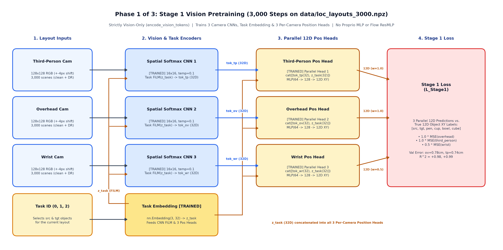
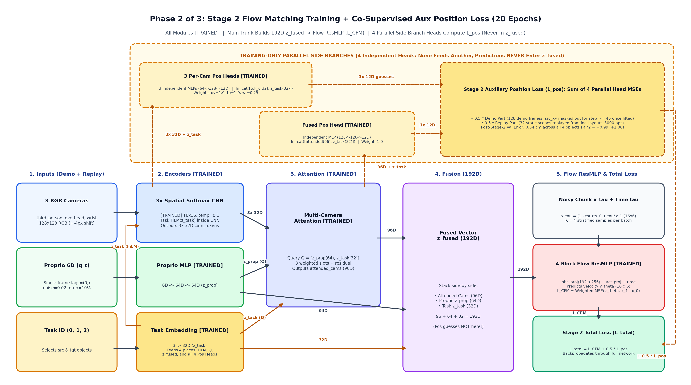
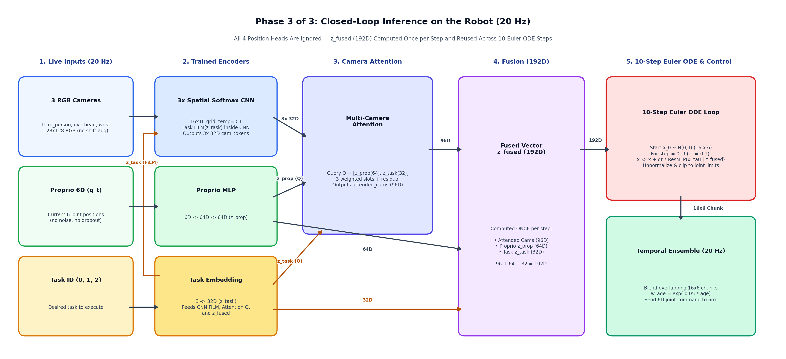

# AlloyFlow: System Design

**AlloyFlow** is a multi-task robot learning project for the **SO-ARM101** robot arm (`5` arm joints + `1` gripper = `6` joints total). It trains a single neural network policy to perform 3 tabletop tasks and compares how well the robot learns from simulation data, real-world data, finetuning, and co-training.

***

## 1. Core Objectives

### Objective 1: Train One Model to Perform 3 Tasks
Train **one single model** that takes 3 camera images (`128x128`), the robot's `6` current joint positions, and a task ID (`0`, `1`, or `2`), and outputs the robot's next `16` steps of joint movements.

All 3 tasks use the same tabletop setup with **4 everyday objects**:
1. **Pen Holder**: A small desktop pen holder without a pen (`4 to 5 cm` wide).
2. **Small Cup**: A lightweight plastic, paper, or espresso cup.
3. **Bowl**: A target container (`~10 cm` wide).
4. **Rubik's Cube**: A standard `5.6 cm` cube used as a flat base for stacking.

By changing only the task ID (`0`, `1`, or `2`), the same model performs 3 different tasks:
1. **Task 0 (`pick_pen_holder_to_bowl`)**: Pick up the pen holder and place it inside the bowl.
2. **Task 1 (`pick_cup_to_bowl`)**: Ignore the pen holder, pick up the small cup, and place it inside the bowl. (Tests picking a different object for the same destination).
3. **Task 2 (`stack_cup_on_cube`)**: Pick up the small cup and stack it on top of the Rubik's cube. (Tests picking the same object as Task 1, but placing it on a different target).

### Objective 2: Compare 4 Training Modes
Using the exact same model architecture and test episodes, compare how the robot performs across **4 training modes**:
1. **Mode 1: `Sim-Only` (`100%` Simulation Data)**
   - **Training**: Trained only on MuJoCo simulation demos (`300` demos per task, `900` total).
   - **Goal**: Measure baseline performance in simulation, and test how well a simulation-only model transfers directly to the real robot without any real training data.
2. **Mode 2: `Real-Only` (`100%` Real Robot Data)**
   - **Training**: Trained only on a small set of real robot demos (`20` demos per task, `60` total).
   - **Goal**: Measure how well the real robot learns from limited real data, and where it fails when objects are placed in new positions.
3. **Mode 3: `Sim -> Real Finetune` (Pretrain in Sim, then Finetune on Real)**
   - **Training**: Start from the `Mode 1 (Sim-Only)` model weights, then continue training on the `20` real demos per task (`60` total).
   - **Goal**: Measure if pretraining in simulation helps real-world performance, and check if finetuning causes the model to forget how to solve the simulation tasks.
4. **Mode 4: `Sim + Real Co-Training` (`50%` Sim + `50%` Real in Every Batch)**
   - **Training**: Train from scratch where every batch of `128` samples pulls `64` samples from the `900` simulation demos and `64` samples from the `60` real robot demos.
   - **Goal**: Test if mixing simulation and real data in every batch gives the best real-world generalization while keeping high performance in simulation.

***

## 2. Robot Hardware & Simulation Setup (`SO-ARM101`)

* **Robot Arm**: 6-DoF **SO-ARM101** (`5` Feetech STS3215 arm servos: `shoulder_pan`, `shoulder_lift`, `elbow_flex`, `wrist_flex`, `wrist_roll` + `1` gripper servo).
* **Inputs & Outputs (`20 Hz`)**:
  - **Input**: `6` current joint positions + `3` RGB camera images (`128x128`) + `1` task ID (`0, 1, 2`).
  - **Output**: A chunk of `16` future joint position targets (`16 x 6`).
* **Cameras**: 3 synchronized `128x128` RGB views (`third_person_cam`, `overhead_cam`, `wrist_cam`).

***

## 3. Repository Structure & CLI Commands

```text
alloyflow/                        # Repository Root
├── assets/
│   ├── stage1_pretrain.png       # Stage 1: Vision Pretraining diagram
│   ├── stage2_training.png       # Stage 2: Flow Matching Training diagram
│   ├── stage3_inference.png      # Stage 3: Closed-Loop 20 Hz Inference diagram
│   └── so101/                    # SO-ARM101 MuJoCo XML + 4 tabletop objects
│
├── envs/                         # Sim and Real environments (shared reset/step API)
│   ├── __init__.py
│   ├── base.py                   # Shared SO101Env interface & 3 Task IDs
│   ├── sim_env.py                # MuJoCo simulation environment
│   ├── real_env.py               # Physical SO-ARM101 robot environment
│   └── tests/
│
├── collection/                   # Step 1: Collect demos (Sim or Real -> .h5)
│   ├── __init__.py
│   ├── sim_expert.py             # Scripted IK planner for Sim demos
│   ├── real_teleop.py            # Leader-follower recorder for Real demos
│   ├── collector.py              # Shared HDF5 file writer
│   ├── __main__.py               # CLI: python -m collection
│   └── tests/
│
├── training/                     # Step 2: Model, Stage 1 pretraining & 4-mode training loop
│   ├── __init__.py
│   ├── config.py                 # Training hyperparameters
│   ├── model.py                  # Vision Flow Matching policy + training-only position heads
│   ├── pretrain_vision.py        # Stage 1 3,000-scene layout generator & vision pretrainer
│   ├── flow_matching.py          # Flow matching loss, auxiliary position loss & ODE sampler
│   ├── dataset.py                # HDF5 loader, 12D object XY labels & Sim+Real batch mixer
│   ├── trainer.py                # Modes: sim_only, real_only, finetune, cotrain
│   ├── __main__.py               # CLI: python -m training
│   └── tests/
│
├── evaluation/                   # Step 3: Evaluate on Sim, Real, or Both
│   ├── __init__.py
│   ├── evaluator.py              # Rollout runner & success rate tracker
│   ├── visualizer.py             # Camera HUD overlay & video recorder
│   ├── __main__.py               # CLI: python -m evaluation
│   └── tests/
│
├── scripts/
│   └── train.sh                  # Unified training launcher (--colab GPU or --local Mac MPS)
│
├── DESIGN.md
├── EXPERIMENT_LOG.md
├── README.md
└── pyproject.toml
```

### CLI Commands
1. **Collect Demos (`Sim` or `Real`)**:
   ```bash
   uv run python -m collection --domain sim --task all --episodes 300 --trajectory-version v2_dart_full --h5-path data/sim_demos_v2_dart_full_900.h5
   uv run python -m collection --domain real --task 0 --episodes 20
   ```
2. **Train Policy (`sim_only`, `real_only`, `finetune`, `cotrain`)**:
   ```bash
   # Train on remote Colab GPU (--colab) or local Mac GPU (--local)
   ./scripts/train.sh exp08_dart_full_900 --colab --mode sim_only --epochs 40
   ./scripts/train.sh exp08_dart_full_900 --local --mode sim_only --epochs 40

   # Co-train on 50% Sim + 50% Real
   uv run python -m training --mode cotrain --real-ratio 0.5
   ```
3. **Evaluate Policy (`120`-Episode Benchmark or Per-Demo Diagnostic GIFs)**:
   ```bash
   uv run python -m evaluation --checkpoint checkpoints/exp08_dart_full_900/best_policy.pt --benchmark --episodes 20
   uv run python -m evaluation --checkpoint checkpoints/exp08_dart_full_900/best_policy.pt --demos demo_0000,demo_0301,demo_0600
   ```
4. **Run Tests**:
   ```bash
   uv run pytest
   ```

***

## 4. Data Collection (`collection/`)

Both simulation and real-world collection save data in the exact same `.h5` file format at **`20 Hz` (one step every `50 ms`)** using identical joint units:
- **Arm Joints (`0..4`)**: Radians (`float32`), measured relative to the robot's home pose.
- **Gripper (`5`)**: Normalized from `0.0` (closed) to `1.0` (open).
- **Camera Images**: Three `128x128` RGB images (`uint8`) per step.

### 4.1 Simulation Data Collection (`--domain sim`)
`collection/sim_expert.py` solves each task in MuJoCo using 6-DoF Inverse Kinematics (IK) across 6 mechanisms (`trajectory_version = "v2_dart_full"` in `data/sim_demos_v2_dart_full_900.h5`):
1. **Hover & Descend**: Move above the source object and lower the open gripper (`0.65 -> 0.62`) down to grasp height.
2. **Full Source + Target DART Recovery Perturbations (`perturbation = "dart_full"`)**: Each episode draws independent horizontal offsets $\delta_{\text{src}}, \delta_{\text{tgt}} \sim \mathcal{U}(0, 2.5\text{ cm})$. During approach and source descent, the executed arm path ramps from `0` at home to full $\delta_{\text{src}}$ at `hover_src`, decays to $\le 0.2\text{ cm}$ at pinch height $dz = 4.5\text{ cm}$, and reaches `0` by $dz = 3.5\text{ cm}$ above the object center. During carry (after the lifted source clears `3.0 cm` above the table) and target lower, the executed path ramps to full $\delta_{\text{tgt}}$ at `hover_tgt` and decays linearly to `0` by `1.5 cm` above the final placement height (`place_z`), while always recording the unperturbed clean `v2` IK joint targets as `actions[t]`.
3. **Close in Place**: Pause at the bottom for `4` nominal steps, close the gripper (`0.60 -> 0.05`) while stationary over `8` nominal steps, and hold for `4` nominal steps before lifting.
4. **Lift & Carry**: Lift the object in a clean upward arc over tabletop clutter to the target bowl or cube.
5. **Open in Place & Retract**: Pause at the target for `3` nominal steps, open the gripper (`0.05 -> 0.65`) while stationary, and retract upward with open jaws.
6. **Speed Variation ($\pm 20\%$)**: Scale segment speeds by $\mathcal{U}(0.8, 1.2)$ on each episode so the policy learns to trigger actions from visual cues rather than memorizing a fixed step timer.

* **Dataset Scale & Domain Randomization (`300` demos per task, `900` total, `128,919` frames)**:
  - **Clean Simulation (`150` demos per task, `450` total)**: Randomized object `(X, Y)` positions across the table with fixed studio lighting and camera mounts.
  - **Domain-Randomized Simulation (`150` demos per task, `450` total)**: Varies lighting direction, object and tabletop colors, $\pm 1\text{ cm}$ camera mount shifts, and object mass (`0.7x to 1.5x`).
  - **Disk-Backed Memory-Mapped Streaming**: `HDF5DemoDataset` unpacks large RGB datasets (`> 4 GB`) into a disk-backed `np.memmap` cache (`19.01 GB` for `900` demos) and streams shuffled `8,192`-sample rolling windows (`1.21 GB` RAM per window) so training fits within standard `12.7 GiB` Colab T4 RAM.

* **4 Automated Quality Checks (Verified Before Saving Any Demo)**:
  Every simulated episode must pass 4 checks before it is written to `.h5` (failed seeds are skipped automatically):
  1. **Spawn Clearance Check**: All 4 objects spawn inside the reachable workspace with at least `8 cm` center-to-center distance and zero initial collisions.
  2. **Grasp & Release Dwell Check**: Preserves explicit short pauses during grasp closure and target release while trimming unintended dead frames.
  3. **Bystander Object Check**: Non-target objects on the table must not be tipped over or pushed more than `1.5 cm` from their starting positions.
  4. **Task Completion & Settling Check**: After releasing the object and retracting the gripper, the simulation steps forward `10` extra settling frames and verifies that the target object rests upright inside the bowl (`Task 0`, `Task 1`) or centered within `2.0 cm` on top of the Rubik's cube (`Task 2`) with the gripper clear.

### 4.2 Real Robot Data Collection (`--domain real`)
`collection/real_teleop.py` records demonstrations on the physical SO-ARM101 using **leader-follower teleoperation** at `20 Hz`:
1. **Leader Arm (Motor Torque Off)**: You move the leader arm by hand. Every `50 ms`, the script reads its `6` servo positions over USB.
2. **Follower Arm (Motor Torque On)**: The follower arm copies the leader arm's `6` joint positions in real time while the script records the follower's actual joint positions, the commanded joint targets, and the 3 USB camera frames.
3. **Keyboard Controls**: Press `SPACE` to start and stop recording an episode, or `r` (`BACKSPACE`) to discard a failed attempt. We collect **`20` demos per task (`60` total)** into `data/real_demos.h5`.

### 4.3 HDF5 File Format (`data/sim_demos_v2_dart_full_900.h5` & `data/real_demos.h5`)
```text
<domain>_demos.h5
├── attrs:
│   ├── num_episodes: N
│   ├── num_cameras: 3
│   ├── control_hz: 20
│   ├── trajectory_version: "v2_dart_full"
│   ├── perturbation: "dart_full"
│   └── camera_names: ["third_person_cam", "overhead_cam", "wrist_cam"]
└── demo_0000/
    ├── attrs:
    │   ├── task_id: 0 | 1 | 2
    │   ├── task_name: str
    │   ├── domain: "sim_clean" | "sim_dr" | "real"
    │   ├── seed: int
    │   ├── num_steps: T
    │   ├── lift_start_step: int
    │   ├── perturbation: "dart_full"
    │   ├── delta_mag_cm: float
    │   ├── delta_xy: float32 (2,)
    │   ├── delta_tgt_mag_cm: float
    │   └── delta_tgt_xy: float32 (2,)
    ├── actions                        # float32 (T, 6) (clean v2 joint targets)
    └── obs/
        ├── proprio                    # float32 (T, 6) (current joint positions)
        ├── rgb_third_person_cam       # uint8   (T, 128, 128, 3)
        ├── rgb_overhead_cam           # uint8   (T, 128, 128, 3)
        └── rgb_wrist_cam              # uint8   (T, 128, 128, 3)
```

***

## 5. Policy Architecture & 3-Stage Pipeline (`training/`)

All 4 training modes (`sim_only`, `real_only`, `finetune`, `cotrain`) train the same **`TaskConditionedVisionFlowPolicy`** network (`1.06M` trainable parameters; `1.03M` active at inference).

### 5.1 The 3-Stage Pipeline

#### Stage 1: Vision Pretraining (`3,000` Labeled Tabletop Scenes)

* **Why**: Action loss alone is slow to teach the CNNs accurate 2D object coordinates across cluttered multi-object scenes.
* **How (`training/pretrain_vision.py`)**: Renders `3,000` static 3-camera scenes (`data/loc_layouts_3000.npz`, `50%` clean + `50%` domain-randomized) and trains the 3 camera CNNs, Task Embedding, and 3 per-camera `12D` object-position heads (`aux_cam_pos_heads`) for `3,000` steps to predict the `(X, Y)` tabletop coordinates of `[source, target, pen_holder, cup, bowl, rubiks_cube]`.

#### Stage 2: Flow Matching Training + Co-Supervised Position Loss (`40` to `60` Epochs)

* **How (`training/trainer.py`, `training/flow_matching.py`)**: Starts from the Stage 1 vision weights and trains the full policy (`batch_size = 128`, cosine learning rate `5e-4 -> 2.5e-5`, with resumable per-epoch `latest.pt` checkpointing).
* **Training-Only Position Side Branch**: The 3 per-camera position heads remain active during Stage 2 as parallel side branches ($\mathcal{L}_{\text{total}} = \mathcal{L}_{\text{CFM}} + 0.5 \cdot \mathcal{L}_{\text{pos}}$, mixing demo frames and replayed Stage 1 layouts) so the CNNs keep sub-centimeter object localization while the Flow ResMLP learns control. Their `12D` coordinate outputs never enter the policy trunk.
* **Best Checkpoint Selection & Zero-Dropout Velocity Head (`dropout = 0.0`)**: At the end of each epoch, evaluates ODE action-chunk error (`val_ode_mse`) on `512` validation samples and saves `best_policy.pt`. With `900` full-DART demonstrations (`128,919` frames), domain randomization, and continuous flow-matching noise ($x_0 \sim \mathcal{N}(0, I)$), the policy uses `dropout = 0.0` and zero internal feature/modality corruption (`keypoint_noise = 0.0`, `proprio_noise_std = 0.0`, `proprio_drop_prob = 0.0`, `wrist_cam_drop_prob = 0.0`). Removing dropout and synthetic feature corruption eliminates the `.train()` vs `.eval()` distribution shift (`val_ode_mse: 0.00220 -> 0.00151`) so training and deterministic `.eval()` inference are `100%` identical at every epoch (`112 / 120 = 93.3%` benchmark pass).

#### Stage 3: Closed-Loop Inference on the Robot (`20 Hz`)

* **Zero Position-Head Overhead & Single-Pass Deterministic `.eval()`**: At inference, the 3 position heads are ignored. Every `50 ms` (`exec_horizon = 1`), the policy encodes the 3 camera images, `6D` joint state, and `task_id` once into `z_fused (192D)`, integrates the `Flow ResMLP` over `5` Euler ODE steps ($\Delta\tau = 0.2$) in deterministic `.eval()` mode (`2.86 ms/step` = `350 Hz` on CPU), and blends overlapping `16 x 6` action chunks via Temporal Ensembling ($w_i = \exp(-0.05 \cdot i)$).

| Component | Stage 1: Vision Pretraining | Stage 2: Policy Training (`dropout = 0.0`) | Stage 3: `20 Hz` Inference |
| :--- | :--- | :--- | :--- |
| **`3x Spatial Softmax CNN`** | Trained from scratch | Fine-tuned | Used (`96D` camera tokens, run once/step) |
| **`Task Embedding (3 -> 32D)`** | Trained from scratch | Fine-tuned | Used (`32D` task vector) |
| **`Proprio MLP (6 -> 64D)`** | Unused | Trained from scratch | Used (`64D` joint vector) |
| **`3 Per-Camera Pos Heads`** | Trained (`12D` XY targets) | Co-supervised (`0.5 * L_pos`) | **Ignored** (zero overhead) |
| **`4-Block Flow ResMLP`** | Unused | Trained (`K=4` flow samples/step, `dropout=0.0`) | Used (`5` Euler ODE steps, `.eval()`) |

***

### 5.2 Model Building Blocks (`training/model.py`)

1. **Task Embedding (`nn.Embedding(3, 32)`)**:
   - Maps `task_id in {0, 1, 2}` to a `32D` vector $\mathbf{z}_{\text{task}}$ shared across Task `FiLM` inside each camera CNN, the `192D` fused vector $\mathbf{z}_{\text{fused}}$, and the training-only position heads.
2. **Proprioception MLP (`6D -> 64D -> 64D`)**:
   - Z-score normalizes the current `6D` joint positions $\mathbf{q}_t$ (`proprio_history_lags = (0,)`) using dataset statistics stored in the checkpoint, and passes them through two `Linear + LayerNorm(64) + SiLU` layers to output $\mathbf{z}_{\text{prop}} \in \mathbb{R}^{64}$.
3. **Tri-Camera Spatial Softmax CNN (`3 x SpatialSoftmaxConvNet`)**:
   - One independent CNN per camera (`third_person_cam`, `overhead_cam`, `wrist_cam`), with $\pm 4\text{ px}$ random image shift augmentation during training.
   - **4 Conv Blocks (`128x128 -> 16x16`)**: `Conv1 (k=5, s=2 -> 64x64)`, `Conv2 (k=3, s=2 -> 32x32)`, `Conv3 (k=3, s=2 -> 16x16)` with `GroupNorm + SiLU`, followed by `Conv4 (k=3, s=1 -> 16x16) + GroupNorm + Task FiLM` (without pre-softmax `SiLU` so negative background logits are suppressed).
   - **2D Spatial Softmax (`16x16` Grid, `32` Keypoints, Learnable `temp=0.1`)**: Extracts `32` expected `(x, y)` keypoint coordinates (`64D`) per camera and projects them via `Linear(64 -> 32) + LayerNorm(32) + SiLU` into camera tokens $\mathbf{z}_{\text{tp}}, \mathbf{z}_{\text{ov}}, \mathbf{z}_{\text{wr}} \in \mathbb{R}^{32}$.
4. **Direct Multi-Camera Concatenation (`192D` Fused Vector)**:
   - Concatenates the three `32D` camera tokens directly with $\mathbf{z}_{\text{prop}}$ (`64D`) and $\mathbf{z}_{\text{task}}$ (`32D`) without cross-camera attention mixing:
     $$\mathbf{z}_{\text{fused}} = [\mathbf{z}_{\text{tp}} (32\text{D}) \,;\, \mathbf{z}_{\text{ov}} (32\text{D}) \,;\, \mathbf{z}_{\text{wr}} (32\text{D}) \,;\, \mathbf{z}_{\text{prop}} (64\text{D}) \,;\, \mathbf{z}_{\text{task}} (32\text{D})] \in \mathbb{R}^{192}$$
5. **Conditional Flow Matching Head (`4-Block ResMLP`, `K = 4` Stratified Sampling, `dropout = 0.0`)**:
   - Projects $\mathbf{z}_{\text{fused}}$ through a 2-layer MLP (`obs_proj`), sums with projected noisy action chunk $x_\tau = (1 - \tau) x_0 + \tau x_1$ and `SinusoidalTimeEmbedding` ($\tau \in [0, 1]$), and runs through `4` pre-norm `ResMLPBlock` layers (`hidden_dim = 256`, `dropout = 0.0`) to predict target velocity $u_\tau = x_1 - x_0$ (`gripper_weight = 2.5` on joint `5`).
   - Evaluates `K = 4` stratified flow timesteps per observation during training so the 3 CNNs run only once per batch.

***

### 5.3 The 4 Training Modes & Default Hyperparameters (`training/config.py`)

| Mode Flag | Training Dataset(s) | Batch Sampling | Learning Rate | Normalization Stats (`norm_stats`) |
| :--- | :--- | :--- | :---: | :--- |
| **`sim_only`** | `data/sim_demos_v2_dart_full_900.h5` (`900` Sim demos) | `128` Sim samples/batch | `5e-4` | Computed from `sim_demos_v2_dart_full_900.h5` & saved in checkpoint |
| **`real_only`** | `data/real_demos.h5` (`60` Real demos) | `128` Real samples/batch | `5e-4` | Computed from `real_demos.h5` & saved in checkpoint |
| **`finetune`** | Pretrained `sim_only` $\to$ `data/real_demos.h5` | `128` Real samples/batch | `1e-4` | **Locked from `sim_only` checkpoint** (no stat drift) |
| **`cotrain`** | `data/sim_demos_v2_dart_full_900.h5` + `data/real_demos.h5` | **`64` Sim + `64` Real** (`real_ratio=0.5`) | `5e-4` | Computed across combined training set & saved |

| Hyperparameter | Default Value | Purpose |
| :--- | :---: | :--- |
| `chunk_size` (`H`) / `proprio_history_lags` | `16` / `(0,)` | `0.8 s` future action horizon (`16 x 6`) and single-frame `6D` joint input. |
| `num_keypoints` / `vision_feat_dim` | `32` / `32` | `32` `(x, y)` keypoints (`16x16` grid, `temp=0.1`) projected to `32D` per camera. |
| `task_emb_dim` / `proprio_emb_dim` / `fused_dim` | `32` / `64` / `192` | `96D (3 cameras) + 64D (proprio) + 32D (task) = 192D`. |
| `hidden_dim` / `num_res_blocks` | `256` / `4` | `ResMLP` width and depth (`1.06M` trainable params; `1.03M` active at inference). |
| `pretrain_loc_steps` / `aux_pos_loss_weight` | `3000` / `0.5` | Stage 1 vision pretraining steps (`data/loc_layouts_3000.npz`) and Stage 2 position loss weight. |
| `num_flow_samples` (`K`) / `gripper_weight` | `4` / `2.5` | Stratified flow samples per CNN pass and loss weight on gripper joint `5`. |
| `shift_pad` / `keypoint_noise` / `dropout` | `4` / `0.0` / `0.0` | Image shift augmentation (`px`) and zero internal feature/velocity dropout (`0.0`). |
| `proprio_noise_std` / `proprio_drop_prob` / `wrist_cam_drop_prob` | `0.0` / `0.0` / `0.0` | Zero synthetic sensor noise and modality dropout (relying on `900` DART demos). |
| `batch_size` / `epochs` / `rolling_window_size` | `128` / `40..60` / `8192` | AdamW (`wd = 1e-4`), `512`-sample `val_ode_mse` check, and `8,192`-sample memmap window. |
| `ode_steps` / `temporal_ensemble_decay` | `5` / `0.05` | Closed-loop inference Euler steps (`.eval()`) and $w_i = \exp(-0.05 \cdot i)$ blending. |

***

## 6. Closed-Loop Evaluation & Visual Diagnostics (`evaluation/`)

`evaluation/evaluator.py` (`SimPolicyEvaluator`) and `evaluation/visualizer.py` (`RolloutVisualizer`) run closed-loop rollouts in `SimEnv` at `20 Hz` (`max_steps = 280`, `14.0 s` horizon) and check whether all task and safety constraints pass (`all_constraints_passed`).

### 6.1 Benchmark Split (`120` Episodes Total)
Running `python -m evaluation --checkpoint <path> --benchmark --episodes 20` evaluates **`120` episodes**:
1. **Training Split (`60` episodes, `20` per task)**: Replays the first `20` `sim_clean` scene seeds per task from `data/sim_demos_v2_dart_full_900.h5` (`seeds 1000..1019`, `11000..11021`, `21000..21019`) to test in-distribution accuracy.
2. **Held-Out Test Split (`60` episodes, `20` per task)**: Evaluates unseen test seeds (`seeds 9000..9019`, `19000..19019`, `29000..29019`) with novel object placements.

### 6.2 Core Funnel Metrics & Diagnostic GIFs
Every benchmark run reports 4 stage-by-stage metrics across all `120` episodes:
1. **Reached Object (`< 2.0 cm`)**: Minimum horizontal distance between the gripper pinch point and the source object.
2. **Centered Grasp (`< 1.5 cm` at close)**: Horizontal offset when the gripper first starts closing (`action[5] < 0.48`).
3. **Lifted Object (`> 2.0 cm`)**: Whether the source object is lifted at least `2.0 cm` above the table.
4. **Task Success (`Strict Pass`)**: Object placed upright inside the goal receptacle with the gripper open and retracted clear, and zero bystander or target collisions.

When `--demos` or `--save-gif` is passed, `RolloutVisualizer` saves a multi-camera `.gif` and a 6-keyframe `.png` strip showing projected `[SRC]` and `[TGT]` markers, the predicted 16-step trajectory ribbon, and live joint telemetry.
